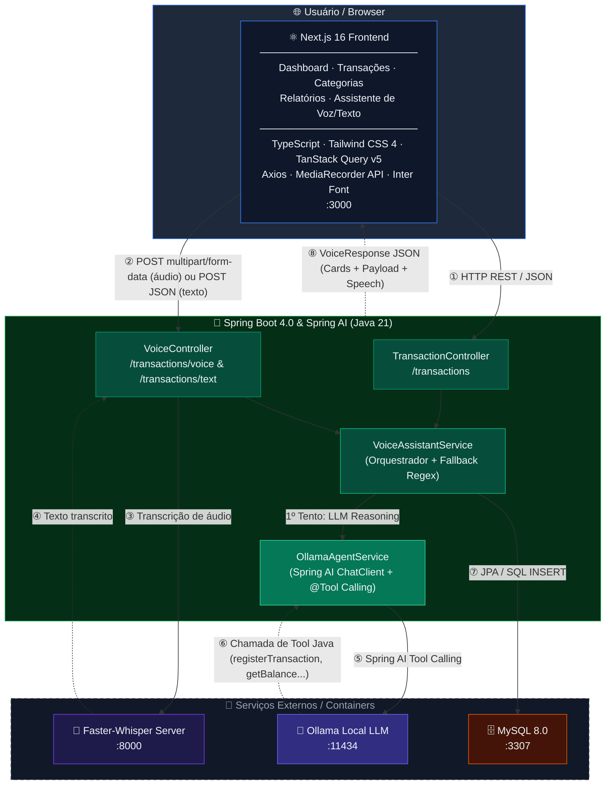

#  Budgeting AI — Controladoria Financeira com Assistente de Voz e IA

[](https://www.oracle.com/java/)
[](https://spring.io/projects/spring-boot)
[](https://spring.io/projects/spring-ai)
[](https://ollama.com/)
[](https://nextjs.org/)
[](https://github.com/fedirz/faster-whisper-server)
[](https://www.docker.com/)

> 🇧🇷 **[Português](#-português)** | 🇺🇸 **[English](#-english)**

---

## 🇧🇷 Português

###  Sobre o Projeto
O **Budgeting AI** é um sistema completo de gestão e controladoria financeira pessoal acionado por inteligência artificial e voz. O projeto une um **Backend robusto em Java 21 com Spring Boot 4 e Spring AI** a um **Frontend moderno e responsivo em Next.js 16**, integrado a um motor local de transcrição de áudio (**Faster-Whisper**) e a um agente inteligente baseado em **Ollama com Tool Calling** (com fallback determinístico por Regex em tempo real).

Com o assistente inteligente (voz ou texto), o usuário pode interagir com frases como *"Gastei 150 reais no mercado hoje"*, *"Quanto tenho de saldo?"* ou *"Quanto gastei em alimentação?"*. A aplicação interpreta a intenção do usuário, extrai valores monetários complexos, aciona as ferramentas Java adequadas via **Spring AI Tool Calling**, persiste os dados no banco MySQL e retorna respostas ricas com componentes visuais e voz sintética.

---

###  Funcionalidades Principais
- 🎤 **Assistente Financeiro por Voz e Texto**: Gravação/envio de áudio ou digitação de comandos em linguagem natural.
- 🧠 **Agente Inteligente com Spring AI & Ollama (Tool Calling)**:
  - **Reasoning & Chamada de Ferramentas**: O Ollama interpreta a intenção e decide autonomamente executar funções Java como `registerTransaction`, `getBalance`, `listTransactions` e `getSpendingByCategory`.
  - **Arquitetura Resiliente em Duas Camadas**: Se o Ollama estiver indisponível, o sistema aciona automaticamente o fallback avançado por Regex e regras heurísticas sem interromper a experiência do usuário.
- 💰 **Extrator Inteligente de Valores**: Processamento de valores monetários complexos como `"1.000"`, `"1.500,50"`, `"2 mil"`, `"mil reais"`, `"10.000"`.
- 📊 **Dashboard Financeiro em Tempo Real**: Indicadores de saldo, receitas, despesas, resumo por categoria e gráfico interativo (Recharts).
- 📂 **Gestão Completa de Categorias e Transações**: Filtros por data, categoria, paginação e cadastro manual.
- 📱 **Interface 100% Responsiva**: Sidebar colapsável em desktop, gaveta (*drawer*) em mobile e tipografia **Inter**.
- 📑 **Documentação Interativa Swagger / OpenAPI 3.0**: Teste visual de todos os endpoints RESTful.

---

###  Tecnologias Utilizadas

#### Backend (API REST)
- **Linguagem**: Java 21 (JDK 21)
- **Framework**: Spring Boot 4.0 (Spring Web, Data JPA, Validation)
- **Framework de IA**: Spring AI 2.0.0 (`spring-ai-starter-model-ollama` com Tool Calling)
- **LLM / Agent**: Ollama (Rodando localmente com modelos como `llama3.2` ou `qwen2.5`)
- **Banco de Dados**: MySQL 8.0 (Container Docker na porta `3307`)
- **Documentação**: SpringDoc OpenAPI / Swagger UI 3.0
- **Serviço de Transcrição**: Faster-Whisper Server CPU (`fedirz/faster-whisper-server:latest-cpu` na porta `8000`)
- **Utilitários**: Lombok, HikariCP

#### Frontend (Web App)
- **Framework**: Next.js 16 (App Router, Turbopack, React 19)
- **Linguagem**: TypeScript
- **Estilização**: Tailwind CSS 4, Tipografia Inter (`next/font/google`), Lucide React Icons
- **Gráficos**: Recharts
- **Gerenciamento de Estado**: TanStack React Query v5
- **Cliente HTTP**: Axios
- **APIs do Navegador**: MediaRecorder API (Gravação de áudio) e Web Speech Synthesis API (Voz sintética)

---

###  Arquitetura do Sistema



####  Fluxo de Comunicação

| # | Origem | Destino | Protocolo | Descrição |
|---|---|---|---|---|
| ① | Frontend | TransactionController | `HTTP REST / JSON` | CRUD de transações, listagem e summary |
| ② | Frontend | VoiceController | `POST multipart/form-data` ou `POST JSON` | Envio de áudio ou comando de texto |
| ③ | VoiceController | Faster-Whisper | `HTTP POST /v1/audio/transcriptions` | Transcrição de áudio em texto (se áudio) |
| ④ | Faster-Whisper | VoiceController | `JSON { text: "..." }` | Retorno do texto transcrito |
| ⑤ | OllamaAgentService | Ollama | `HTTP / Spring AI` | Execução do prompt com `@Tool` calling registrado |
| ⑥ | Ollama | OllamaAgentService | `Tool Call Execution` | Invocação automática das ferramentas Java (`registerTransaction`, etc.) |
| ⑦ | VoiceAssistantService | MySQL | `JPA / SQL INSERT` | Persistência da transação criada no banco de dados |
| ⑧ | Spring Boot API | Frontend | `JSON VoiceResponse` | Resposta rica com cards visuais, resumo e texto para síntese de voz |

---

###  Como Executar o Projeto

#### Pré-requisitos
- [Docker & Docker Compose](https://www.docker.com/)
- [Java 21 JDK](https://www.oracle.com/java/technologies/downloads/#java21)
- [Node.js 18+](https://nodejs.org/)
- [Ollama](https://ollama.com/) (para inteligência local completa via Spring AI)

#### 1️⃣ Clonar o Repositório
```bash
git clone https://github.com/gabrielmdujardin/budgetingAI.git
cd budgetingAI
```

#### 2️⃣ Subir os Containers Docker (MySQL & Faster-Whisper)
```bash
docker compose up -d
```
> Os containers sobem o MySQL na porta `3307` e o Faster-Whisper na porta `8000`.

#### 3️⃣ Inicializar o Ollama (Opcional, porém recomendado para IA Completa)
Certifique-se de ter o Ollama em execução com um modelo suportado instalado (ex: `llama3.2`):
```bash
ollama run llama3.2
```

#### 4️⃣ Executar o Backend (Spring Boot)
No Windows PowerShell / CMD:
```bash
.\mvnw.cmd spring-boot:run
```
No Linux / macOS:
```bash
./mvnw spring-boot:run
```
> O backend estará rodando em: `http://localhost:8080`  
> Documentação Swagger UI: `http://localhost:8080/swagger-ui.html`

#### 5️⃣ Executar o Frontend (Next.js)
Em outro terminal:
```bash
cd frontend
npm install
npm run dev
```
> Acesse a aplicação no navegador: `http://localhost:3000`  
> Acesse o Assistente de Voz/Texto: `http://localhost:3000/assistant`

---

###  Endpoints da API (Swagger / OpenAPI)

| Método | Endpoint | Descrição |
|---|---|---|
| `GET` | `/transactions` | Lista lançamentos com filtros opcionais de categoria e período |
| `POST` | `/transactions` | Cria uma transação manualmente |
| `DELETE` | `/transactions/{id}` | Deleta um lançamento por ID |
| `GET` | `/transactions/summary` | Retorna o resumo totalizado de gastos por categoria |
| `POST` | `/transactions/voice` | Recebe arquivo de áudio (`multipart/form-data`) e retorna interpretação por IA/Regex |
| `POST` | `/transactions/text` | Recebe comando em texto (`application/json`) e interpreta a intenção via IA/Regex |

---

<br />

---

## 🇺🇸 English

###  About the Project
**Budgeting AI** is a complete personal financial management and control system powered by artificial intelligence, voice commands, and natural text processing. The project connects a **robust Java 21 Spring Boot 4 + Spring AI Backend** with a **modern Next.js 16 Frontend**, integrated with a local audio transcription engine (**Faster-Whisper**) and an intelligent AI agent powered by **Ollama with Tool Calling** (with a deterministic Regex fallback).

Through the voice and text assistant, users can interact using commands like *"Spent 150 dollars on groceries today"*, *"What is my balance?"*, or *"Show my expenses"*. The system interprets the intent, extracts monetary values, invokes Java tools via **Spring AI Tool Calling**, persists entries in MySQL, and returns rich UI cards with text-to-speech support.

---

###  Key Features
- 🎤 **Voice & Text Financial Assistant**: Local audio recording or natural language typing.
- 🧠 **AI Agent with Spring AI & Ollama (Tool Calling)**:
  - **Reasoning & Tool Execution**: Ollama determines intent and calls Java functions (`registerTransaction`, `getBalance`, `listTransactions`, `getSpendingByCategory`).
  - **Two-Layer Resilient Architecture**: Seamless fallback to Regex rules if the LLM engine is unavailable.
- 💰 **Intelligent Amount Extractor**: Parses complex monetary values such as `"1.000"`, `"1,500.50"`, `"2 thousand"`, `"10,000"`.
- 📊 **Real-Time Financial Dashboard**: Balance metrics, income vs expenses, category summary, and interactive charts.
- 📂 **Complete Category & Transaction Management**: Date/category filtering, pagination, and manual entry.
- 📱 **100% Responsive UI**: Collapsible sidebar, mobile drawer menu, built with official **Inter** font.
- 📑 **Interactive Swagger / OpenAPI 3.0**: Visual REST API testing interface.

---

###  Tech Stack

#### Backend
- **Language**: Java 21
- **Framework**: Spring Boot 4.0 (Spring Web, Data JPA, Validation)
- **AI Framework**: Spring AI 2.0.0 (`spring-ai-starter-model-ollama` with Tool Calling)
- **LLM Engine**: Ollama (running locally with models like `llama3.2` or `qwen2.5`)
- **Database**: MySQL 8.0 (Docker container on port `3307`)
- **Documentation**: SpringDoc OpenAPI / Swagger UI 3.0
- **Transcription Service**: Faster-Whisper Server CPU (`fedirz/faster-whisper-server:latest-cpu` on port `8000`)

#### Frontend
- **Framework**: Next.js 16 (App Router, Turbopack, React 19)
- **Language**: TypeScript
- **Styling**: Tailwind CSS 4, Inter Font (`next/font/google`), Lucide React Icons
- **Charts**: Recharts
- **State & Data Fetching**: TanStack React Query v5
- **HTTP Client**: Axios
- **Browser APIs**: MediaRecorder API & Web Speech Synthesis API

---

### 📂 Getting Started

#### 1️⃣ Clone the Repository
```bash
git clone https://github.com/gabrielmdujardin/budgetingAI.git
cd budgetingAI
```

#### 2️⃣ Start Docker Containers
```bash
docker compose up -d
```

#### 3️⃣ Start Ollama (Optional, recommended for AI Agent functionality)
```bash
ollama run llama3.2
```

#### 4️⃣ Run Backend
```bash
.\mvnw.cmd spring-boot:run
```
> API available at: `http://localhost:8080`  
> Swagger UI at: `http://localhost:8080/swagger-ui.html`

#### 5️⃣ Run Frontend
```bash
cd frontend
npm install
npm run dev
```
> Access Web App at: `http://localhost:3000`

---

### 📄 License
Distributed under the MIT License. Developed for portfolio and educational demonstration.

