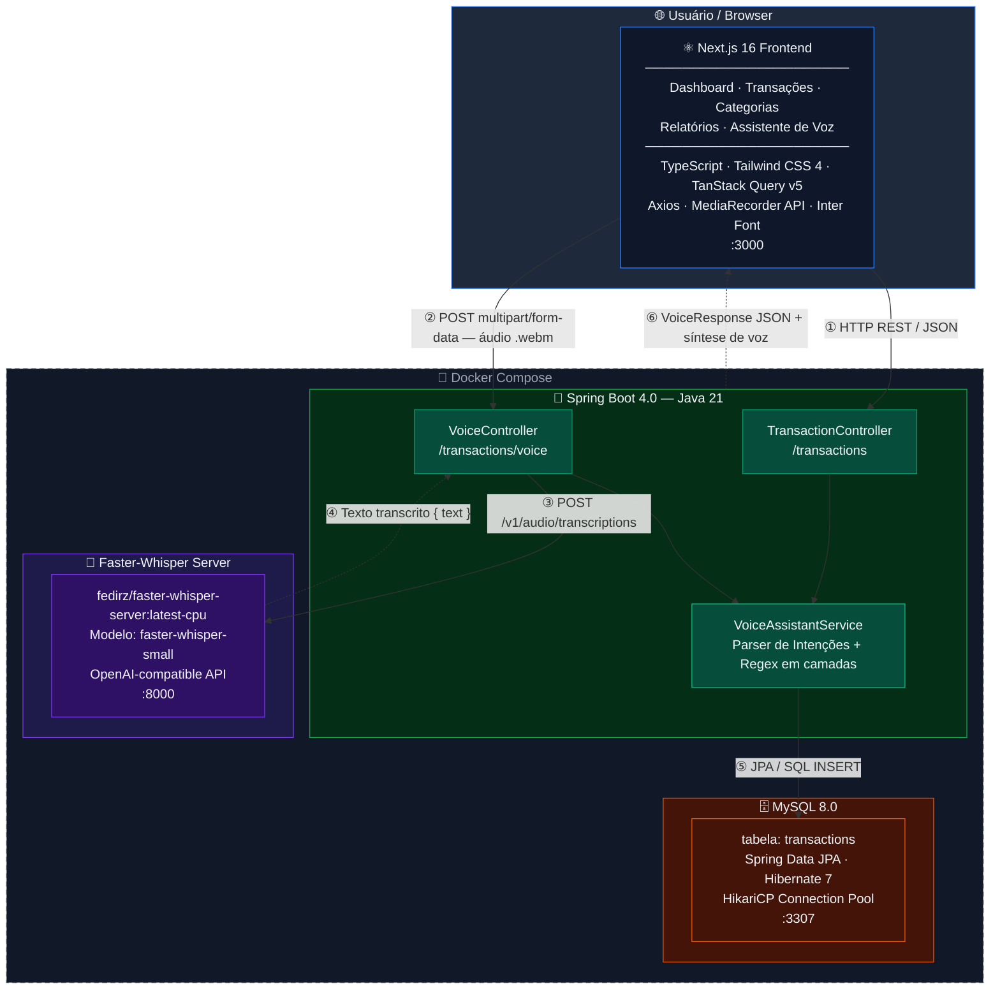

#  Budgeting AI — Controladoria Financeira com Assistente de Voz e IA

[](https://www.oracle.com/java/)
[](https://spring.io/projects/spring-boot)
[](https://nextjs.org/)
[](https://github.com/fedirz/faster-whisper-server)
[](https://www.docker.com/)

> 🇧🇷 **[Português](#-português)** | 🇺🇸 **[English](#-english)**

---

## 🇧🇷 Português

###  Sobre o Projeto
O **Budgeting AI** é um sistema completo de gestão e controladoria financeira pessoal acionado por inteligência artificial e voz. O projeto une um **Backend robusto em Java 21 com Spring Boot** a um **Frontend moderno e responsivo em Next.js 16**, integrado a um motor local de IA (**Faster-Whisper**) para transcrição e interpretação de comandos de voz em tempo real.

Com o assistente de voz, o usuário pode gravar áudios ou enviar arquivos como *"Gastei 1500 reais no mercado"* ou *"Quanto tenho de saldo?"*, e a aplicação identifica automaticamente valores (mesmo falados por extenso ou formatados com milhar), escolhe a categoria adequada, salva a transação no banco de dados MySQL e sintetiza a resposta por áudio e texto.

---

###  Funcionalidades Principais
-  **Assistente Financeiro por Voz**: Gravação e processamento de áudio local com Faster-Whisper.
-  **Interpretação de Intenções por IA**:
  - Cadastro automático de despesas e receitas por comando falado.
  - Consulta de saldo total e estimado.
  - Listagem e filtragem de lançamentos por categoria por voz.
-  **Extrator Inteligente de Valores**: Processamento de valores monetários complexos como `"1.000"`, `"1.500,50"`, `"2 mil"`, `"mil reais"`, `"10.000"`.
-  **Dashboard Financeiro em Tempo Real**: Indicadores de saldo, receitas, despesas, resumo por categoria e gráfico interativo.
-  **Gestão Completa de Categorias e Transações**: Filtros por data, categoria, paginação e cadastro manual.
-  **Interface 100% Responsiva**: Sidebar colapsável em telas desktop e menu gaveta com desfoque (*backdrop blur*) em dispositivos móveis, com a tipografia oficial **Inter**.
- 📑 **Documentação Interativa Swagger / OpenAPI 3.0**: Teste visual de todos os endpoints RESTful.

---

###  Tecnologias Utilizadas

#### Backend (API Rest)
- **Linguagem**: Java 21 (JDK 21)
- **Framework**: Spring Boot 4.0 (Spring Web, Data JPA, Spring AI)
- **Banco de Dados**: MySQL 8.0 (Container Docker na porta `3307`)
- **Documentação**: SpringDoc OpenAPI / Swagger UI 3.0
- **Serviço de IA**: Faster-Whisper Server CPU (`fedirz/faster-whisper-server:latest-cpu` na porta `8000`)
- **Utilitários**: Lombok, HikariCP

#### Frontend (Web App)
- **Framework**: Next.js 16 (App Router, Turbopack, React 19)
- **Linguagem**: TypeScript
- **Estilização**: Tailwind CSS 4, Tipografia Inter (`next/font/google`), Lucide React Icons
- **Gerenciamento de Estado**: TanStack React Query v5
- **Cliente HTTP**: Axios
- **APIs do Navegador**: MediaRecorder API (Gravação de áudio) e Web Speech Synthesis API (Voz sintética)

---

###  Arquitetura do Sistema



####  Fluxo de Comunicação

| # | Origem | Destino | Protocolo | Descrição |
|---|---|---|---|---|
| ① | Frontend | TransactionController | `HTTP REST / JSON` | CRUD de transações, listagem e summary |
| ② | Frontend | VoiceController | `POST multipart/form-data` | Envio do arquivo `.webm` de áudio gravado |
| ③ | VoiceController | Faster-Whisper | `HTTP POST /v1/audio/transcriptions` | Transcrição do áudio em texto |
| ④ | Faster-Whisper | VoiceController | `JSON { text: "..." }` | Texto transcrito retornado |
| ⑤ | VoiceAssistantService | MySQL | `JPA / SQL INSERT` | Persistência da transação criada por voz |
| ⑥ | Spring Boot API | Frontend | `JSON VoiceResponse` | Resultado + texto para síntese de voz no browser |

---

###  Como Executar o Projeto

#### Pré-requisitos
- [Docker & Docker Compose](https://www.docker.com/)
- [Java 21 JDK](https://www.oracle.com/java/technologies/downloads/#java21)
- [Node.js 18+](https://nodejs.org/)

#### 1️⃣ Clonar o Repositório
```bash
git clone https://github.com/gabrielmdujardin/budgetingAI.git
cd budgetingAI
```

#### 2️⃣ Subir os Containers Docker (MySQL & Faster-Whisper)
```bash
docker compose up -d
```
> Os containers sobem o MySQL na porta `3307` e o Faster-Whisper na porta `8000`.

#### 3️⃣ Executar o Backend (Spring Boot)
No Windows PowerShell / CMD:
```bash
.\mvnw.cmd spring-boot:run
```
No Linux / macOS:
```bash
./mvnw spring-boot:run
```
> O backend estará rodando em: `http://localhost:8080`  
> Documentação Swagger UI: `http://localhost:8080/swagger-ui.html`

#### 4️⃣ Executar o Frontend (Next.js)
Em outro terminal:
```bash
cd frontend
npm install
npm run dev
```
> Acesse a aplicação no navegador: `http://localhost:3000`  
> Acesse o Assistente de Voz: `http://localhost:3000/assistant`

---

###  Endpoints da API (Swagger / OpenAPI)

| Método | Endpoint | Descrição |
|---|---|---|
| `GET` | `/transactions` | Lista lançamentos com filtros opcionais de categoria e período |
| `POST` | `/transactions` | Cria uma transação manualmente |
| `DELETE` | `/transactions/{id}` | Deleta um lançamento por ID |
| `GET` | `/transactions/summary` | Retorna o resumo totalizado de gastos por categoria |
| `POST` | `/transactions/voice` | Recebe arquivo de áudio (`multipart/form-data`) e retorna interpretação por IA |

---

<br />

---

## 🇺🇸 English

###  About the Project
**Budgeting AI** is a complete personal financial management and control system powered by artificial intelligence and voice commands. The project connects a **robust Java 21 Spring Boot Backend** with a **modern Next.js 16 Frontend**, integrated with a local AI engine (**Faster-Whisper**) for real-time voice transcription and intent interpretation.

Through the voice assistant, users can record audio or upload files such as *"Spent 1500 dollars on groceries"* or *"What is my balance?"*. The system automatically detects amounts (even spoken in full words or formatted with thousands separators), categorizes the entry, persists it in the MySQL database, and synthesizes text and speech responses.

---

###  Key Features
-  **Voice Financial Assistant**: Local audio recording and transcription using Faster-Whisper.
-  **AI Intent Interpretation**:
  - Automatic transaction creation via voice commands.
  - Real-time balance and financial status inquiries.
  - Category filtering and listing through natural speech.
-  **Intelligent Amount Extractor**: Parses complex monetary values such as `"1.000"`, `"1,500.50"`, `"2 thousand"`, `"10,000"`.
-  **Real-Time Financial Dashboard**: Balance metrics, income vs expenses, category summary, and interactive charts.
-  **Complete Category & Transaction Management**: Filter by date, category, pagination, and manual entry.
-  **100% Responsive UI**: Collapsible sidebar on desktop and backdrop-blurred drawer menu on mobile, built with official **Inter** typography.
-  **Interactive Swagger / OpenAPI 3.0**: Visual REST API testing interface.

---

###  Tech Stack

#### Backend
- **Language**: Java 21
- **Framework**: Spring Boot 4.0 (Spring Web, Data JPA, Spring AI)
- **Database**: MySQL 8.0 (Docker container on port `3307`)
- **Documentation**: SpringDoc OpenAPI / Swagger UI 3.0
- **AI Engine**: Faster-Whisper Server CPU (`fedirz/faster-whisper-server:latest-cpu` on port `8000`)

#### Frontend
- **Framework**: Next.js 16 (App Router, Turbopack, React 19)
- **Language**: TypeScript
- **Styling**: Tailwind CSS 4, Inter Font (`next/font/google`), Lucide React Icons
- **State & Data Fetching**: TanStack React Query v5
- **HTTP Client**: Axios
- **Browser APIs**: MediaRecorder API & Web Speech Synthesis API

---

### 📂 Getting Started

#### 1️⃣ Clone the Repository
```bash
git clone https://github.com/gabrielmdujardin/budgetingAI.git
cd budgetingAI
```

#### 2️⃣ Start Docker Containers
```bash
docker compose up -d
```

#### 3️⃣ Run Backend
```bash
.\mvnw.cmd spring-boot:run
```
> API available at: `http://localhost:8080`  
> Swagger UI at: `http://localhost:8080/swagger-ui.html`

#### 4️⃣ Run Frontend
```bash
cd frontend
npm install
npm run dev
```
> Access Web App at: `http://localhost:3000`

---

### 📄 License
Distributed under the MIT License. Developed for portfolio and educational demonstration.
