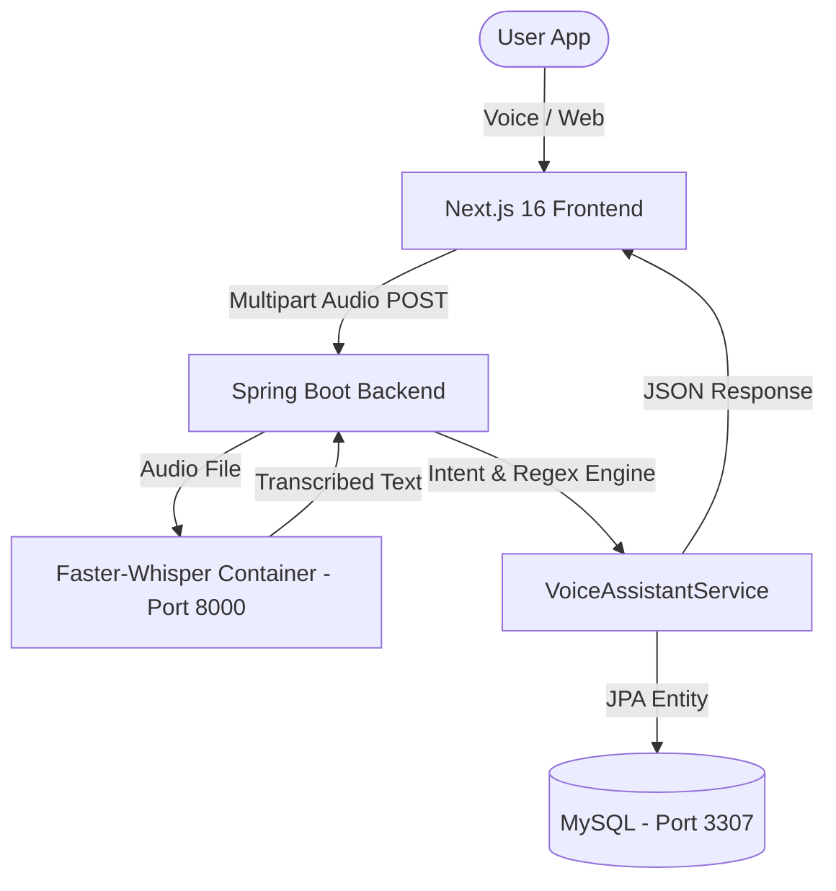

# 💰 Budgeting AI — Voice-Controlled Financial Control System

[](https://www.oracle.com/java/)
[](https://spring.io/projects/spring-boot)
[](https://nextjs.org/)
[](https://github.com/fedirz/faster-whisper-server)
[](https://www.docker.com/)

> 🇺🇸 **English README** | 🇧🇷 **[Versão em Português](./README.md)**

---

## 📌 Project Overview
**Budgeting AI** is a personal finance management system powered by artificial intelligence and voice interactions. Built with a **Java 21 Spring Boot Backend** and a **Next.js 16 Frontend**, it connects to a local AI speech recognition engine (**Faster-Whisper**) to transcribe and interpret voice commands in real-time.

---

## 🚀 Key Features
- 🎤 **Voice Assistant**: Record and send voice commands directly from the browser.
- 🧠 **AI Intent Parser**: Converts natural spoken phrases like *"Spent 1500 on groceries"* into structured transactions.
- 🔢 **Multi-Format Amount Extraction**: Supports formatted strings (`1.000`, `1.500,50`, `10.000`) and spoken Portuguese words (`mil`, `dois mil`).
- 📊 **Interactive Financial Dashboard**: Total balance, monthly expenses, income metrics, and category distribution charts.
- 🏷️ **Category Management**: Organized categories with real-time financial aggregation.
- 📱 **Fully Responsive UI**: Modern Inter font typography, collapsible desktop sidebar, and backdrop-blurred mobile drawer.
- 📑 **Swagger OpenAPI 3.0**: Fully documented REST API endpoints.

---

## 🗄️ Architecture



---

## 🛠️ Quick Start

### 1. Docker Services (MySQL & Faster-Whisper)
```bash
docker compose up -d
```

### 2. Backend
```bash
.\mvnw.cmd spring-boot:run
```
Swagger UI available at: `http://localhost:8080/swagger-ui.html`

### 3. Frontend
```bash
cd frontend
npm install
npm run dev
```
Access app at: `http://localhost:3000`
